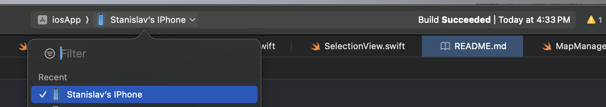
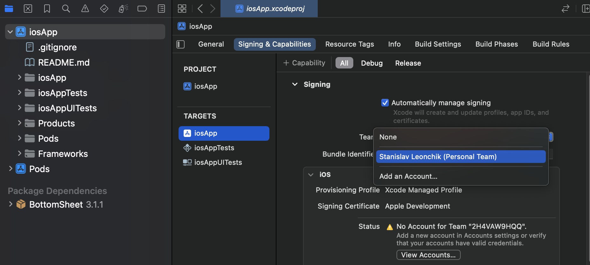
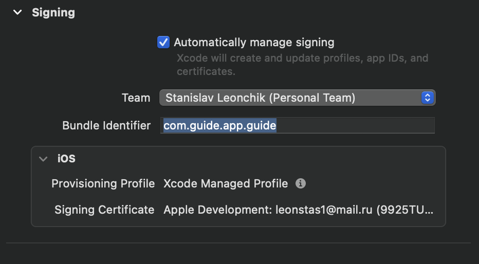

#  ios-app


#### 1. Клонирование репозитория
```bash
git clone https://summer-school-2024.gitlab.yandexcloud.net/summer-school-group/team-35
git checkout -b ios-main
cd team-35/ios-app/iosApp
```

#### 2. Установка зависимостей
```bash
sudo gem install cocoapods
pod install
```

#### 3. Запуск проекта
```bash
iosApp.xcworkspace
```

#### 4. Выберите локальное устройство для билда



#### 5. Выберите аккаунт разработчика в файле iosApp.xcodeproj



#### 6. Выберите валидный bundle identifier



#### 7. Запустите приложение